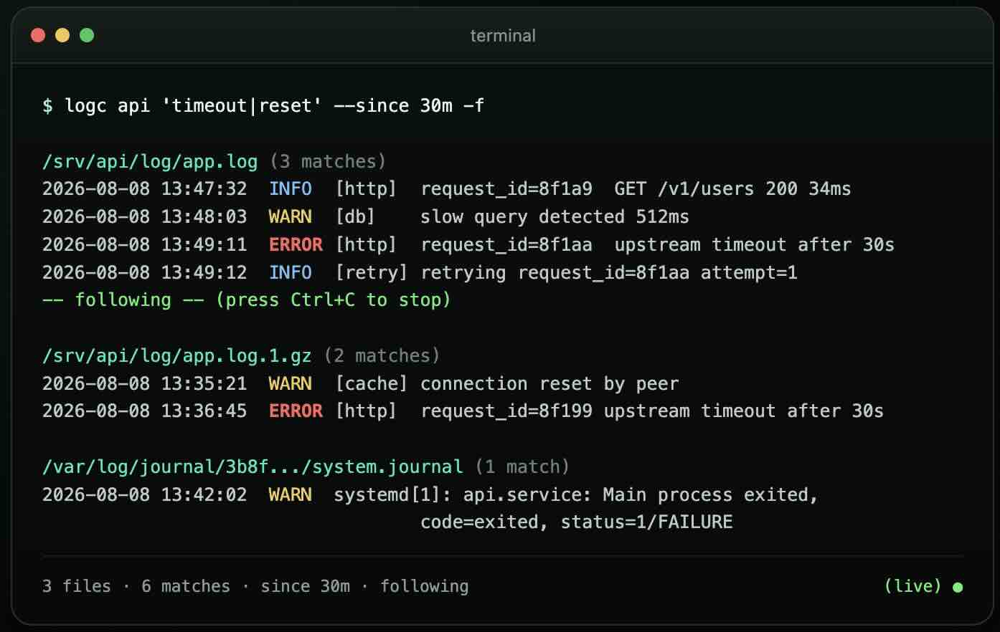

# logc

> One command to find, search, and follow local logs.

```bash
brew install logc
```

> Homebrew installation is under construction. Until the formula is published, install from source with `go install github.com/zchensh/logc@latest`.



```bash
logc api 'timeout|reset' --since 30m -f
```

| Before | After |
| --- | --- |
| `find` + `grep` + `zgrep` + `tail` | `logc` |
| Remember paths, rotated files, and shell pipelines. | Name the service and follow the signal. |

**[Download a release](https://github.com/zchensh/logc/releases)** · **[Fork and contribute](https://github.com/zchensh/logc/fork)** · **[Configuration](#configuration)**

## Why logc

`logc` is a dependency-free Go CLI for local log triage. It brings application-log discovery, regular-expression search, history, and fair multi-file follow into one interface.

- **Discover** recent application logs without memorizing paths.
- **Search** active, rotated, and gzip-compressed logs without switching between `grep` and `zgrep`.
- **Follow** multiple files fairly, even when one source is noisy.
- **Resolve** services by configured name, file path, directory, glob, Linux process/PID, or listening port.
- **Separate** application logs from common operating-system logs.

## Quick Start

```bash
# Discover and follow recent application logs.
logc

# Follow a named source from ~/.logc.conf.
logc api

# Search a source, then follow new matching lines.
logc api 'timeout|reset' --since 30m -f
```

`logc` searches `/var/log`, `/opt/var/log`, and `/opt/log` by default. It considers files modified in the last 24 hours, shows up to 20 files and 10 initial lines per file, then follows those files for new lines. It applies configured `ignore_line` filters throughout.

## Build and Install

Requires Go 1.22+.

```bash
git clone https://github.com/debugc-clis/logc.git
cd logc
make build
sudo install -m 755 bin/logc /usr/local/bin/logc
logc version
```

For a user-local install managed by Go instead, run:

```bash
go install github.com/zchensh/logc@latest
```

## Common Workflows

### Find the right source

```bash
logc ls                    # List discovered and configured sources.
logc where api             # Show the files matched by a source.
logc /srv/api/log          # Follow all supported logs in a directory.
logc '/srv/**/logs/*.log'  # Follow a recursive glob and discover new files.
```

Configure memorable names when paths are inconvenient:

```ini
group.api=/srv/api/log/*.log

[group.payment]
path=/srv/payment/**/*.log
```

### Search without pipelines

```bash
logc api ERROR
logc api 'timeout|connection reset'
logc ERROR                         # Search default application logs.
logc api error -i -C 3 --since 2h
logc api ERROR --dedup
logc api ERROR --current            # Skip rotated and .gz history.
```

The expression is a Go-compatible regular expression. Searches include matching rotated and `.gz` logs by default; `--current` restricts the result to active files. `ERROR`, `errors`, `WARN`, and `warnings` are severity shortcuts.

### Resolve a running service (Linux)

```bash
logc @nginx   # Process name; falls back to a systemd unit when appropriate.
logc @12345   # PID.
logc :8080    # Listening port → PID → open log files.
```

`logc` inspects `/proc/<pid>/fd` for process-owned log files. Port lookup uses `lsof`, with `ss` as a Linux fallback.

### Stream system logs

```bash
logc system
logc system --kernel
```

On Linux, `logc` uses `journalctl` when available and falls back to `dmesg`; macOS uses `log stream`.

## What You Get

- **Fair follow mode** — Polls files every 250ms and flushes small per-file batches so a hot log cannot monopolize the terminal.
- **Bounded buffering** — Keeps the newest 2,000 buffered lines per file by default and reports dropped lines when the terminal cannot keep up.
- **Rotation aware** — Detects log replacement and truncation while following.
- **Readable output** — Prints a full path per block; colors ERROR/FATAL/PANIC red, WARN yellow, and DEBUG/TRACE dim when stdout is a terminal. `NO_COLOR` and `--no-color` disable color.
- **Noise control** — Applies `ignore_line` regular expressions to snapshots, searches, and follow mode.

## Configuration

The default configuration path is `~/.logc.conf`. Set `LOGC_CONFIG=/path/to/logc.conf` to use another file.

```bash
logc config init
logc config path
logc config show
```

Example configuration:

```ini
# Roots scanned by plain `logc`.
default_log_dir=/var/log
default_log_dir=/opt/var/log
default_log_dir=/srv

# Add custom exclusions. Prefix an exact built-in pattern with ! to remove it.
exclude=/srv/**/debug*.log
# exclude=!/var/log/syslog*

# Hide recurring request noise everywhere.
ignore_line=.*GET /health.*
ignore_line=.*GET /metrics.*

# Named sources.
# `mysql` is built in and searches common MySQL/MariaDB file-log paths.
# Add a custom path when your database uses a nonstandard data directory.
group.mysql=/srv/mysql/log/*.log
group.api=/srv/api/log/*.log
[group.payment]
path=/srv/payment/**/*.log

lines=10
max_files=20
recent=24h
flush_interval=500ms
scan_interval=1s
max_batch_lines=10
max_buffer_lines=2000
color=true
```

On Linux, logc detects the distribution from `/etc/os-release` and automatically excludes the important operating-system debugging logs for that distribution. User, cron, package-manager, and installer logs are not excluded by default. Run `logc config show` to inspect the active patterns.

## Installation

### Source

Requires Go 1.22+.

```bash
go install github.com/zchensh/logc@latest
```

Or build from a checkout:

```bash
make build
sudo install -m 755 bin/logc /usr/local/bin/logc
```

### Releases

Tagged releases publish downloadable archives for:

```text
linux/amd64   linux/arm64
darwin/amd64  darwin/arm64
```

Each release includes SHA-256 checksums. See [GitHub Releases](https://github.com/zchensh/logc/releases).

### Homebrew

The `Formula/logc.rb` template is included, but the public Homebrew formula is not available yet. When it is published, the install command at the top of this page will work.

## Contributing

logc is open source and free to use. Fork the repository, build the feature you need, and open a pull request.

- [Fork logc](https://github.com/zchensh/logc/fork)
- [Report an issue](https://github.com/zchensh/logc/issues)
- [Browse the source](https://github.com/zchensh/logc)

## Scope

logc focuses on local logs and SRE ergonomics. It does not send logs to a remote service or perform AI analysis. Its source resolution and filtering pipeline is designed to support future analyzers without reimplementing discovery and command composition.

## AI and Liability Notice

Parts of this project were generated or assisted by AI and are provided as-is. To the maximum extent permitted by law, the author and contributors are not liable for any results, damages, losses, or other consequences arising from use of this software. Review and test it before using it in production.
